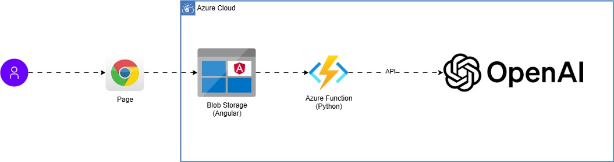

# Projeto AI Arch Review

Projeto de análise de imagens de arquitetura de sistemas usando o modelo STRIDE, com backend em **Python (Azure Functions)** e frontend em **Angular**.  
O sistema permite enviar imagens, gerar anotações automáticas e uma análise detalhada em Markdown.


## Visão Geral da Arquitetura




## Estrutura do repositório

```
repo-root/
│
├─ backend/ # Python + Azure Functions
│ ├─ adapters/
│ ├─ assets/
│ ├─ image-upload-python/
│ │ ├─ __init__.py
│ ├─ resources/
│ ├─ services/
│ ├─ host.json
│ ├─ local.settings.json
│ └─ requirements.txt
│
├─ frontend/ # Angular
│ ├─ image-upload-angular/
│ │ │ ├─ src/
│ │ │ │ ├─ app/
│ │ │ │ │ ├─ image-upload/
│ │ │ │ │ ├─ interceptors/
│ │ │ │ │ ├─ services/
│ │ │ │ ├─ assets/
│ │ │ │ ├─ index.html
│ ├─ package.json
│ ├─ angular.json
│ └─ src/
│
└─ README.md
```

### Pasta `backend/` (Python + Azure Functions)
Contém todo o código do backend escrito em **Python**, exposto como Azure Functions.

- **adapters/**  
  Camada de integração com sistemas externos ou bibliotecas.  
  Exemplo: adaptadores para APIs, bancos de dados ou serviços de nuvem.

- **assets/**  
  Arquivos estáticos utilizados pelo backend (imagens de referência, templates JSON, etc.).

- **image-upload-python/**  
  Pasta que contém a **Azure Function principal**.  
  - `__init__.py` → ponto de entrada da Function, onde está a lógica do upload/processamento da imagem.

- **resources/**  
  Arquivos auxiliares como schemas, exemplos de payloads ou dados de teste.

- **services/**  
  Camada de serviços de negócio.  
  Aqui ficam as regras de negócio, chamadas ao modelo STRIDE e geração de relatórios.

- **host.json**  
  Arquivo de configuração global da Function App (logging, extensões, timeouts, etc.).

- **local.settings.json**  
  Configurações locais para rodar em desenvolvimento (variáveis de ambiente, connection strings).  
  ⚠️ Não deve ser versionado em produção.

- **requirements.txt**  
  Lista de dependências Python necessárias para rodar o backend.

### Pasta `frontend/` (Angular)
Contém todo o código do frontend em **Angular**, responsável pela interface do usuário.

- **image-upload-angular/**  
  Aplicação Angular principal.  
  - **src/** → código-fonte da aplicação
    - **app/** → núcleo da aplicação Angular
      - **image-upload/** → componente principal para upload e exibição da imagem processada
      - **interceptors/** → interceptores HTTP (ex: autenticação, logging, tratamento de erros)
      - **services/** → serviços Angular para comunicação com o backend
    - **assets/** → arquivos estáticos usados pelo frontend (imagens, ícones, estilos globais)
    - **index.html** → página principal carregada pelo navegador

- **package.json**  
  Configurações de dependências do projeto Angular.

- **angular.json**  
  Configurações do workspace Angular (build, serve, assets, etc.).

- **src/**  
  Pasta raiz de código-fonte criada automaticamente pelo Angular CLI (pode conter estilos globais, environments, etc.).

### Arquivo `README.md`
Documento principal do repositório.  
Explica o propósito do projeto, instruções de setup, deploy e boas práticas.

## Backend (Python + Azure Functions)

### Pré-requisitos
- Python 3.9+
- [Azure Functions Core Tools](https://learn.microsoft.com/en-us/azure/azure-functions/functions-run-local)
- Variáveis de ambiente:
  - `OPENAI_API_KEY` → chave de API da OpenAI

### Instalando dependências
```bash
cd backend
python -m venv .venv
source .venv/bin/activate  # Linux/Mac
.venv\Scripts\activate     # Windows
pip install -r requirements.txt
```

### Rodando localmente
```bash
func start
```

## Deploy do Backend (Python + Azure Functions)

### Criando a Function App no Portal Azure

1. Acesse o [Portal Azure](https://portal.azure.com).
2. No menu lateral, clique em **Criar um recurso** → **Compute** → **Function App**.
3. Preencha os campos principais:
   - **Subscription**: selecione sua assinatura.
   - **Resource Group**: crie um novo ou use existente.
   - **Function App name**: escolha um nome único.
   - **Publish**: Code.
   - **Runtime stack**: Python.
   - **Version**: selecione a mesma versão instalada localmente (ex: Python 3.9).
   - **Region**: escolha a mais próxima de você.
4. Em **Hosting**, escolha:
   - **Storage account**: nova ou existente.
   - **Plan type**: Consumption (serverless).
5. Clique em **Revisar + criar** e depois em **Criar**.
6. Aguarde o deploy terminar e acesse o recurso criado.

### Deploy do projeto via VS Code

#### Pré-requisitos
- [VS Code](https://code.visualstudio.com/) instalado
- Extensão **Azure Functions** instalada no VS Code
- Projeto já inicializado em `backend/` (conforme estrutura do repositório)

#### Passos

1. Abra o VS Code na pasta `backend`:
   ```bash
   cd backend
   code .
   ```

2. No VS Code:

- Faça login no Azure (ícone do Azure na barra lateral → Sign in to Azure).
- Clique em Deploy to Function App.
- Escolha sua assinatura e selecione a Function App criada no portal.

3. O VS Code fará:

- Empacotamento do projeto.
- Upload para a Function App na Azure.
- Configuração automática das dependências.


#### Configuração de variáveis no Portal Azure

1. No Portal, abra sua Function App.
2. Vá em Configuration → Application settings.
3. Adicione as variáveis necessárias, por exemplo:
    - `OPENAI_API_KEY`
4. Salve as alterações e reinicie a Function App.

#### Testando no Portal

1. Acesse sua Function App no portal.
2. Vá em Functions → selecione sua função.
3. Clique em Test/Run, insira os parâmetros (ex: arquivo ou JSON) e execute.
4. Você também pode acessar a URL pública gerada e testar pelo navegador ou Postman.

## Frontend (Angular)

### Pré-requisitos
 - Node.js 18+
 - Angular CLI

### Instalando dependências

```bash
cd frontend
npm install
```

### Rodando localmente

```bash
ng serve
```

O frontend será servido em `http://localhost:4200`.


## Deploy do Frontend Angular no Azure Blob Storage

#### Pré-requisitos

* Conta Azure com Storage Account criada
* Container configurado com Static Website habilitado
* Angular CLI instalada

#### Passos para build e deploy

1. Build do Angular para produção
    ```bash
    cd frontend
    cd image-upload-angular
    ng build --configuration production
    ```

    O build será gerado na pasta `dist/image-upload-angular`

2. Habilitar site estático no Azure Storage
    * Acesse o portal Azure → sua Storage Account → Static website → Ative o recurso.
    * Defina index.html como Index document.
    * Defina index.html como Error document (mesmo arquivo, devido particularidade do angular).

3. Subir arquivos via portal
    * Vá em Containers → seu container público.
    * Clique em Upload → selecione todos os arquivos e pastas da pasta `dist/image-upload-angular/browser`.

4. Acessar o site
    * Após upload, acesse a URL fornecida na seção Static website do portal Azure.
    * O Angular estará disponível como site estático.

Dica: Para atualizações futuras, repita o build e substitua os arquivos no container.

## Funcionamento
1. Acesse o frontend.
2. Faça upload de uma imagem.
3. O backend envia a imagem para o modelo STRIDE e gera:
    * Overlay com anotações da imagem
    * Markdown detalhado de análise STRIDE
4. O frontend exibe a imagem anotada e o Markdown renderizado.

## Boas práticas

* Separar repositórios se o projeto crescer: backend e frontend.
* Não versionar arquivos de configuração sensíveis (local.settings.json, .env).
* Utilizar CI/CD separado:
    * Backend → testes Python, deploy Azure Functions
    * Frontend → build Angular, deploy em static hosting

## Tecnologias utilizadas

* Backend: Python 3, Azure Functions, OpenAI API
* Frontend: Angular, Angular Material, ngx-markdown